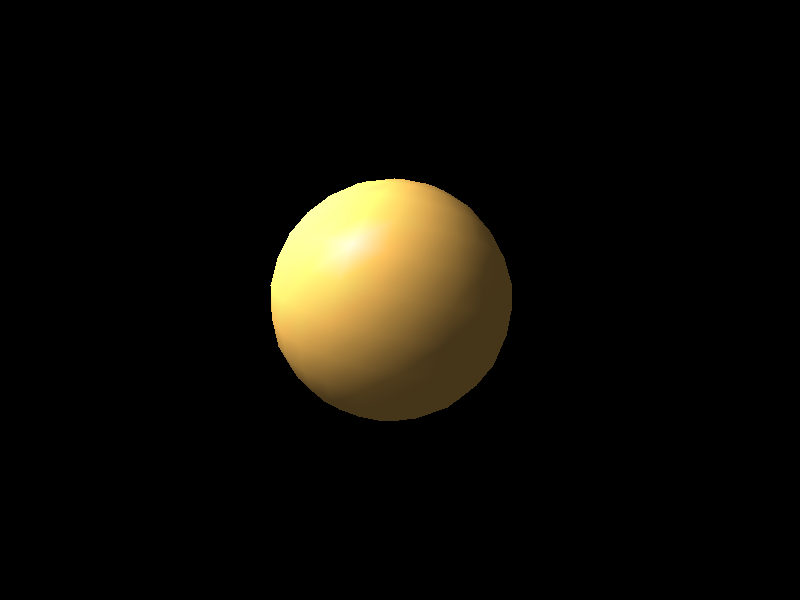
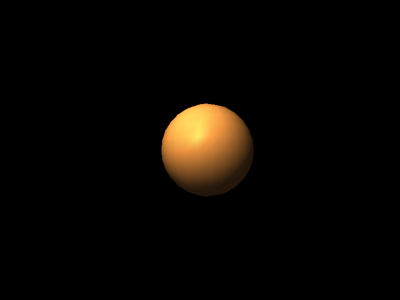

# Phong reflection model

Implementation of Phong reflection model along with Phong shading

## Setup

### 1) Create and activate virtual environment
```powershell
python -m venv .venv
.\.venv\Scripts\activate
```

### 2) Install dependencies
```powershell
pip install -r requirements.txt
```

### 3) Run
```powershell
python -m main
```

## Controls

- `W` / `S` — move forward / backward  
- `A` / `D` — move left / right  
- `R` / `F` — move up / down  

- `Left` / `Right` — rotate around Y axis  
- `Up` / `Down` — rotate around X axis  
- `Q` / `E` — rotate around Z axis  

- `Z` / `X` — increase / decrease focal length 
- `M` - change material
- `+` / `-` - increase / decrease lightning intensity
- `H` — reset camera position
- `P` — screenshot  
- `Esc` — exit

## Preview


